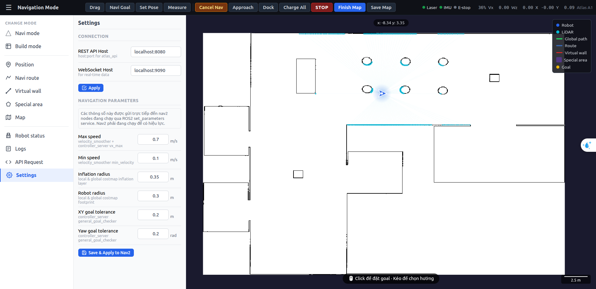
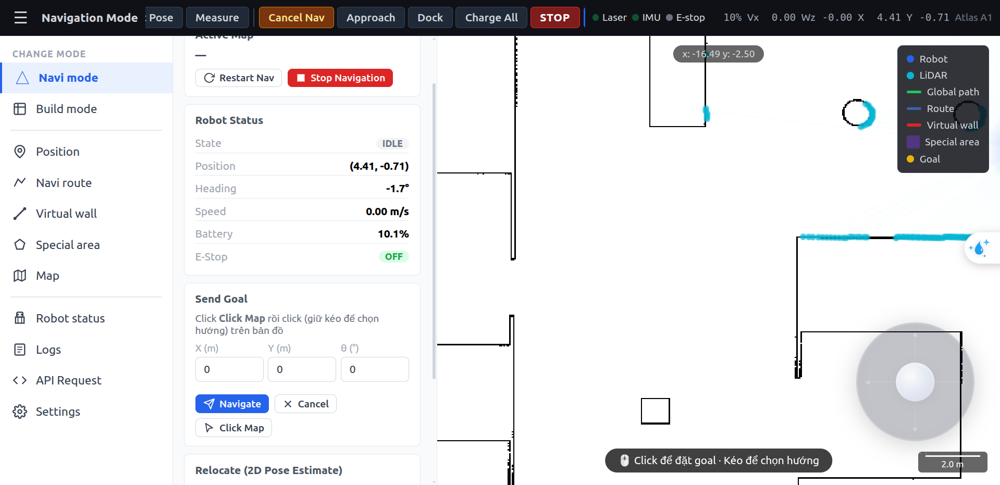

# atlas_web — Robot Web Dashboard

**Author:** Bui Quoc Doanh  
**Contact:** roboticsvn.ai@gmail.com  
**Package:** `atlas_web`  
**ROS 2 Distribution:** Humble  

---

## 1. Tổng quan

`atlas_web` là giao diện điều khiển robot dạng web, chạy trên trình duyệt. Package hoạt động như một **static file server** — toàn bộ logic xử lý nằm ở phía client (JavaScript), giao tiếp với `atlas_api` qua REST và WebSocket.

**Đặc điểm:**
- Không yêu cầu framework frontend (Vue/React) — thuần HTML/CSS/JS
- Hiển thị bản đồ OccupancyGrid thời gian thực trên canvas
- Overlay LiDAR, robot, waypoints, routes, virtual walls, special areas
- Điều khiển đầy đủ: điều hướng, bản đồ, cài đặt
- Responsive — hoạt động trên tablet và màn hình lớn

---

## 2. Kiến trúc

```
┌──────────────────────┐        HTTP :8080          ┌─────────────────┐
│   Trình duyệt        │ ◄──── REST API ──────────► │   atlas_api     │
│                      │                             │   (Flask)       │
│  index.html          │ ◄──── WS :9090 ──────────► │   (WebSocket)   │
│  ├─ api.js           │       5 Hz status           │                 │
│  ├─ map.js           │                             └─────────────────┘
│  ├─ panels.js        │
│  └─ main.js          │
└──────────────────────┘
         ▲
         │ HTTP :8888
┌──────────────────────┐
│  atlas_web server    │
│  (Flask static)      │
└──────────────────────┘
```

### Luồng khởi động

```
Trình duyệt mở http://<host>:8888
    │
    ├─► Load index.html, css/style.css, js/*.js
    ├─► main.js: kết nối WebSocket ws://<host>:9090
    ├─► WebSocket nhận "status" → cập nhật UI (5 Hz)
    ├─► Fetch GET /atlas/map/image → render bản đồ lên canvas
    └─► Fetch GET /atlas/status, /atlas/map/list, ... → populate panels
```

---

## 3. Cấu trúc thư mục

```
atlas_web/
├── atlas_web/
│   ├── server.py          ← Flask static server (entry point)
│   └── static/
│       ├── index.html     ← Single page application
│       ├── css/
│       │   └── style.css  ← Toàn bộ style
│       └── js/
│           ├── api.js     ← HTTP/WS client, gọi atlas_api
│           ├── map.js     ← Canvas map engine: render, zoom, pan, overlay
│           ├── panels.js  ← Logic từng panel (nav, build, waypoints, ...)
│           └── main.js    ← Entry: khởi tạo, kết nối WS, điều phối
├── launch/
│   └── atlas_web.launch.py
├── docs/
│   └── img/               ← Ảnh tài liệu (đặt screenshots vào đây)
└── README.md
```

---

## 4. Cấu hình

### 4.1 ROS Parameters

| Parameter | Mặc định | Mô tả |
|-----------|---------|-------|
| `port` | `8888` | Port phục vụ web UI |
| `api_host` | `localhost:8080` | Địa chỉ atlas_api REST (dùng trong log) |

### 4.2 Launch

```bash
# Build
colcon build --packages-select atlas_web
source install/setup.bash

# Chạy
ros2 launch atlas_web atlas_web.launch.py

# Tùy chỉnh port
ros2 launch atlas_web atlas_web.launch.py port:=9000
```

### 4.3 Kết nối đến atlas_api

`atlas_web` không cần biết địa chỉ `atlas_api` ở server-side. Toàn bộ kết nối được xử lý bởi JavaScript trong trình duyệt.

**Mặc định trong `api.js`:**
```javascript
const API_BASE = `http://${location.hostname}:8080`;   // REST
const WS_URL   = `ws://${location.hostname}:9090`;     // WebSocket
```

`location.hostname` tự động lấy IP/hostname của server, nên không cần cấu hình thêm khi robot và máy tính cùng mạng.

> Nếu atlas_api chạy trên máy khác, thay `location.hostname` bằng IP cụ thể trong `api.js`.

---

## 5. Giao diện — Hướng dẫn sử dụng

> **Lưu ý:** Lưu screenshot vào `docs/img` để hiển thị trong tài liệu này.

### 5.1 Tổng quan giao diện



Giao diện chia 4 vùng chính:

```
┌─────────────────── TOP BAR ──────────────────────────────────┐
│ ☰ Navigation Mode │ [Drag][Navi Goal][Set Pose]… │ Laser IMU │
├──────────┬───────────────────────────────────────────────────┤
│          │                                                   │
│ SIDEBAR  │              MAP CANVAS                           │
│          │                                                   │
│ [Navi]   │   • Bản đồ OccupancyGrid                         │
│ [Build]  │   • Robot (mũi tên xanh)                          │
│ [Pos]    │   • LiDAR overlay (chấm cyan)                     │
│ [Route]  │   • Waypoints, Routes, Virtual walls              │
│ [Wall]   │                                                   │
│ [Area]   │                                                   │
│ [Map]    │                                                   │
│ [Status] │                                                   │
│ [Logs]   │                                                   │
│ [API]    │                                                   │
│ [Sett.]  │                                                   │
└──────────┴───────────────────────────────────────────────────┘
```

---

### 5.2 Top Bar — Thanh trạng thái

Luôn hiển thị ở trên cùng:

| Thành phần | Mô tả |
|-----------|-------|
| `☰` | Ẩn/hiện sidebar |
| **Mode label** | Tên chế độ hiện tại |
| **Toolbar** | Nút công cụ thay đổi theo chế độ |
| `● Laser` | Trạng thái LiDAR (xanh = ok, đỏ = lỗi) |
| `● IMU` | Trạng thái IMU |
| `● E-stop` | Trạng thái dừng khẩn cấp (đỏ = active) |
| `62%` | Phần trăm pin |
| `Vx / Wz` | Tốc độ tuyến tính / góc hiện tại |
| `X / Y` | Tọa độ robot trên bản đồ |

---

### 5.3 Chế độ Navigation (Navi Mode)



**Toolbar Navigation:**

| Nút | Phím tắt | Chức năng |
|-----|---------|----------|
| **Drag** | — | Pan bản đồ (kéo) |
| **Navi Goal** | — | Click bản đồ để đặt điểm đến; click+kéo để chọn hướng |
| **Set Pose** | — | Click+kéo để relocate robot (đặt lại vị trí trên bản đồ) |
| **Measure** | — | Đo khoảng cách giữa 2 điểm |
| **Cancel Nav** | — | Hủy điều hướng đang chạy |
| **Approach** | — | Đến trước trạm sạc (stage 1) |
| **Dock** | — | Vào trạm sạc (stage 2) |
| **Charge All** | — | Tự động approach + dock |
| **STOP** | — | Dừng khẩn cấp — gửi lệnh vận tốc 0 |

**Panel bên trái — Navigation Mode:**

- **Active Map** — Tên bản đồ đang dùng
- **Restart Nav / Stop Navigation** — Khởi động lại hoặc dừng Nav2 stack
- **Robot Status** — State, Position, Heading, Speed, Battery, E-Stop
- **Send Goal** — Nhập X/Y/θ thủ công hoặc click bản đồ
- **Relocate (2D Pose Estimate)** — Chỉnh vị trí robot khi bị lạc

**Cách đặt Goal bằng bản đồ:**
1. Chọn tool **Navi Goal** trên toolbar
2. Click vào vị trí đích trên bản đồ → đặt goal ngay
3. Hoặc click+giữ+kéo → chọn hướng robot khi đến đích

---

### 5.4 Chế độ Build (Mapping)

Kích hoạt khi chuyển sang **Build mode** từ sidebar.

**Toolbar Build:**

| Nút | Chức năng |
|-----|----------|
| **Finish Map** | Kết thúc quá trình mapping, chuyển về Navigation |
| **Save Map** | Lưu bản đồ hiện tại |

**Cách tạo bản đồ:**
1. Chọn **Build mode** → hệ thống tự khởi động `slam_toolbox`
2. Điều khiển robot đi khắp khu vực cần scan
3. Bản đồ được build real-time trên canvas
4. Nhấn **Save Map** → nhập tên → lưu
5. Nhấn **Finish Map** → chuyển sang Navigation với bản đồ vừa tạo

---

### 5.5 Panel Position

Hiển thị và cập nhật tọa độ robot real-time:
- **X, Y** (m) — vị trí trong frame `map`
- **Heading θ** (độ) — hướng nhìn
- Nút **Pick on Map** — click bản đồ để lấy tọa độ
- Nút **Current** — lấy tọa độ hiện tại của robot

---

### 5.6 Panel Navi Route

Quản lý và thực thi routes:

1. **Tạo route:**
   - Nhập tên route
   - Thêm waypoints vào danh sách (kéo để sắp xếp)
   - Bật **Loop** nếu muốn lặp lại
   - Lưu route

2. **Chạy route:**
   - Chọn route từ danh sách
   - Nhấn **Start** → robot tự động đi qua từng waypoint
   - Nhấn **Stop** để dừng

Route path (đường màu tím) hiển thị trên bản đồ khi đang chạy.

---

### 5.7 Panel Virtual Wall

Vẽ tường ảo ngăn robot đi qua:

1. Chọn **Draw** → vẽ đường trên bản đồ bằng cách click nhiều điểm
2. Double-click để kết thúc đường
3. Tường được render thành keepout zone trong Nav2 costmap
4. Nút **Clear All** xóa tất cả tường

---

### 5.8 Panel Special Area

Định nghĩa vùng đặc biệt:

| Loại | Mô tả |
|------|-------|
| **Slow Zone** | Robot giảm tốc khi đi qua (cài đặt % speed) |
| **Forbidden** | Robot không được đi vào (keepout) |
| **Trigger** | Kích hoạt hành động khi robot vào vùng |

**Cách thêm:**
1. Chọn loại vùng
2. Vẽ polygon trên bản đồ
3. Cài đặt tốc độ (với slow zone)
4. Lưu

---

### 5.9 Panel Map

Quản lý bản đồ đã lưu:

- **Danh sách bản đồ** với thumbnail nhỏ
- **Apply** — chuyển sang bản đồ khác (hot-swap không cần restart)
- **Rename** — đổi tên hiển thị
- **Export** — tải file `.yaml`
- **Import** — upload bản đồ từ file
- **Delete** — xóa bản đồ

---

### 5.10 Panel Robot Status

Hiển thị chi tiết trạng thái:

| Thông tin | Nguồn |
|----------|-------|
| Battery % + voltage | `/atlas/battery` |
| IMU acceleration/gyro | `/atlas/imu` |
| Nav state | Nav2 action feedback |
| Launch status | LaunchManager |
| Current map | map_api |

---

### 5.11 Panel Logs

Hiển thị log hoạt động gần đây (API calls, lỗi, sự kiện navigation).

---

### 5.12 Panel API Request

Giao diện test API trực tiếp từ trình duyệt — nhập endpoint và body JSON, xem response. Hữu ích khi debug hoặc tích hợp.

---

### 5.13 Panel Settings

| Cài đặt | Mô tả |
|---------|-------|
| Max Speed | Tốc độ tối đa (0.1–1.0 m/s) |
| Inflation Radius | Bán kính inflate costmap |
| Robot Radius | Bán kính robot |
| Goal Tolerance | Dung sai vị trí đích |
| Language | Ngôn ngữ giao diện |

Thay đổi được apply ngay vào Nav2 qua `/atlas/settings`.

---

## 6. Map Canvas — Các lớp hiển thị

| Lớp (layer) | Màu | Mô tả |
|------------|-----|-------|
| Bản đồ nền | Grayscale | OccupancyGrid từ `/map` |
| Robot | Xanh lam (►) | Vị trí + hướng từ TF2 |
| LiDAR | Cyan (chấm) | Điểm quét từ `/atlas/scan_filtered` |
| Global path | Xanh lá | Đường đi từ Nav2 planner |
| Route | Tím | Đường waypoints của route |
| Virtual wall | Đỏ | Tường ảo đang active |
| Special area | Tím nhạt | Vùng đặc biệt |
| Goal | Vàng | Điểm đích hiện tại |

**Điều hướng bản đồ:**
- **Scroll** — zoom in/out
- **Drag (pan mode)** — di chuyển bản đồ
- Click vào bản đồ (trong các chế độ tool) — đặt goal/pose/measure

---

## 7. Yêu cầu

### Server (Robot computer)
```
Python 3.10+
flask
rclpy
```

### Client (Trình duyệt)
- Chrome, Firefox, Safari, Edge (phiên bản mới)
- Không cần cài đặt thêm — thuần HTML/JS

---

## 8. Hướng dẫn áp dụng cho robot khác

### 8.1 Thay địa chỉ API

Trong `static/js/api.js`, thay đổi địa chỉ kết nối nếu atlas_api không cùng host:

```javascript
// Cấu hình mặc định — tự động dùng cùng hostname
const API_BASE = `http://${location.hostname}:8080`;
const WS_URL   = `ws://${location.hostname}:9090`;

// Hoặc cấu hình cứng
const API_BASE = 'http://192.168.1.100:8080';
const WS_URL   = 'ws://192.168.1.100:9090';
```

### 8.2 Thay tên robot trên UI

Trong `static/index.html`, dòng:
```html
<span class="si-val robot-type">Atlas A1</span>
```
Thay `Atlas A1` bằng tên robot của bạn.

### 8.3 Thay logo / màu sắc

Trong `static/css/style.css`:
```css
/* Màu chủ đạo */
:root {
    --accent: #0af;        /* Màu chính (xanh) */
    --bg: #0d1117;         /* Nền tối */
}
```

### 8.4 Thêm panel mới

1. Thêm nav item trong `index.html`
2. Thêm panel HTML trong sidebar
3. Đăng ký logic trong `panels.js`
4. Thêm API call trong `api.js` nếu cần

### 8.5 Chạy trên port khác

```bash
ros2 launch atlas_web atlas_web.launch.py port:=8080
```

---

## 9. Triển khai thực tế

### Một máy (robot + web)

```
Robot computer: chạy atlas_api (:8080/:9090) + atlas_web (:8888)
Laptop operator: mở trình duyệt http://<robot-ip>:8888
```

### Hai máy riêng biệt

```
Robot computer:  chạy atlas_api (:8080/:9090)
Server/Laptop:   chạy atlas_web (:8888)
                 Cấu hình api.js → IP robot
```

---

## 10. Build & Chạy nhanh

```bash
# Build
colcon build --packages-select atlas_web
source install/setup.bash

# Chạy (mặc định port 8888)
ros2 launch atlas_web atlas_web.launch.py

# Mở trình duyệt
xdg-open http://localhost:8888
```

> Đảm bảo `atlas_api` đang chạy trước, sau đó mới mở trình duyệt.
